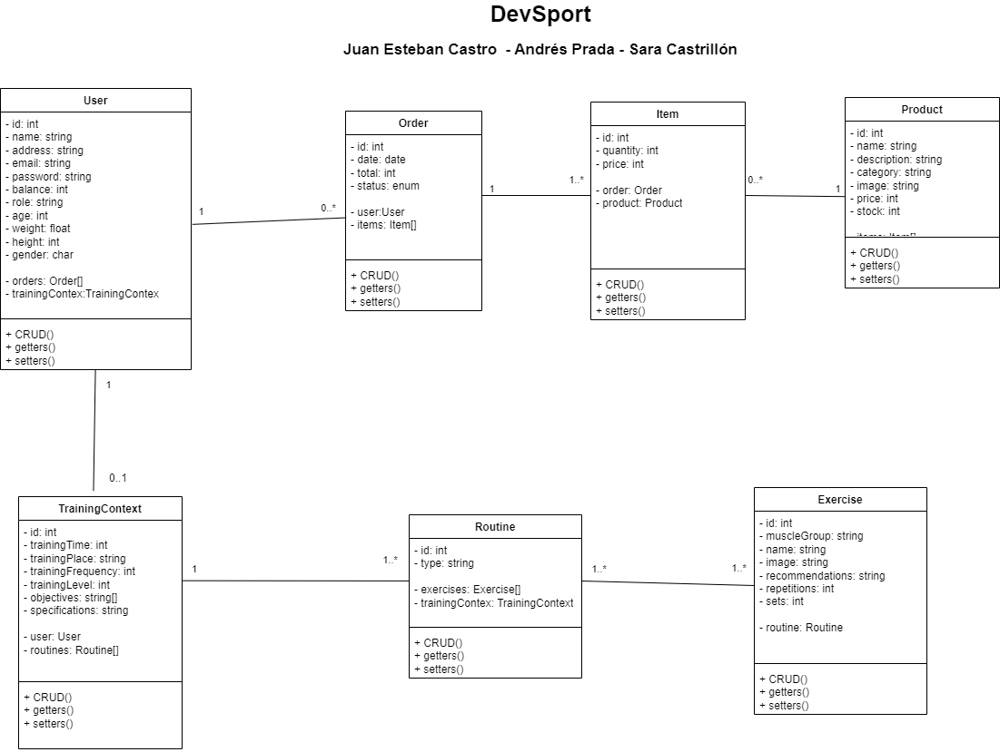

# DevSport



## Description

DevSport is a PHP e-commerce application built using Laravel framework. Designed to provide an exceptional experience in the purchase of sporting goods. DevSport not only allows users to acquire high-quality products at low prices, but also innovates with the integration of a personalized coach based on artificial intelligence.

## Definitive verbal model
we are developing a sports store with functionality to create routines from the propmts to an AI, where there will be two types of users, the admin and the user, the admin is in charge of viewing the database, adding new products , delete, edit, also the same with the exercises that are also part of the propmt that is done to the AI, and by giving us the user can navigate the page, see the products, add them to the cart and buy them, they also have the possibility of Create training plans by filling out the data in a form to create the routines. The project will go so far as to be able to create routines through AI, we are not going to get into the issue of purchases.

As a benefit compared to other sports sales pages, we want our users to see us as more than a store and we help them create better habits, this in order to make our products more attractive, since our audience is healthy people.


### Actors:
Sara Maria Castrillon - Architect - Programmer
Juan Esteban Castro - Programmer
Andrés Prada - Programmer


## Prerequisites

Before running the project, make sure you have the following software installed:

- XAMPP: [XAMPP](https://www.apachefriends.org/download.html) is the most popular PHP development enviroment. Is an Apache distribution containg MySQL, PHP, and Perl. 
- Composer: Is a tool for dependency managment in PHP.

## Installation

### Step 1: Clone The Repository

1. Clone the project from [the repository](https://www.apachefriends.org/download.html).

### Step 2: Install XAMPP

1. Download XAMPP from the official [website](https://www.apachefriends.org/download.html).
2. Run the installer and follow the on-screen instructions.
3. Choose the components you want to install (Apache, MySQL, PHP, etc.).
4. Select the installation directory and complete the installation process.

### Step 3: Install Composer

1. Download Composer from the official [website](https://getcomposer.org/download/).
2. Run the installer and follow the on-screen instructions.
3. Choose the installation directory and complete the installation process.

### Step 4: Run the Project

1. Open XAMPP Control Panel.
2. Start the Apache and MySQL services.
3. Open your web browser and enter "http://localhost/phpmyadmin" to access phpMyAdmin.
4. Create a new database for your project.
5. Open a command prompt or terminal and navigate to the project folder.
6. Run the following command to install project dependencies:
   ```
   composer install
   ```


### Step 5: Create a ".evn" file:

1. Duplicate the ".env.example" file and change its name to ".env":
```
cp .env.example .env
```
2. Change and add your sensitive information:

```
DB_CONNECTION=mysql
DB_HOST=127.0.0.1
DB_PORT=3306
DB_DATABASE= <<name_of_your_database>>
DB_USERNAME= <<you_user_name>>
DB_PASSWORD= <<your_password>>
```

**Note**: 
- Take into account that Laravel 11 will be using sqlite as its default database, change this configuration to your own database, in this case "mysql" will be used.
- By default your database credentials will be: 
```
DB_USERNAME= root
DB_PASSWORD= 
```	

3. Generate Application Key: Run the following command to generate a unique application key:

```
php artisan key:generate
```

This key is used for encryption and should be kept secret.

### How To Use The Models

Into phpMyAdmin create a new database called "devSport".

1. **Database Configuration**: Open the project in your preferred code editor. Navigate to the `.env` file in the root directory of the project. Update the database configuration parameters such as `DB_HOST`, `DB_PORT`, `DB_DATABASE`, `DB_USERNAME`, and `DB_PASSWORD` according to your local database settings.

Remember to change the .env configuration:

```
DB_CONNECTION=mysql
DB_HOST=127.0.0.1
DB_PORT=3306
DB_DATABASE=devsport
DB_USERNAME=root
DB_PASSWORD=
```

2. **Migrate the Database**: Run the following command in your terminal to migrate the database schema to your local database:

   ```
   php artisan migrate
   ```

   This command will create the necessary tables in your local database based on the migrations defined in the project.

3. **Seed the Database (Optional)**: If the project includes seeders to populate the database with initial data, you can run the following command to execute the seeders:

   ```
   php artisan db:seed
   php artisan db:seed --class=ExerciseSeeder
   ```

   This will populate the database with sample data defined in the seeders.

4. **Using the Model**: Now that the database is set up, you can use the model within your project to interact with the database. In your controllers or other parts of the application, import the model class and use its methods to perform CRUD (Create, Read, Update, Delete) operations on the database.


## How To Run The Project

Finally you can run the program using Artisan's serve command to start a development server. Run the following command:
```
php artisan serve
```

This will start a development server at http://localhost:8000, allowing you to access the application in your web browser.
